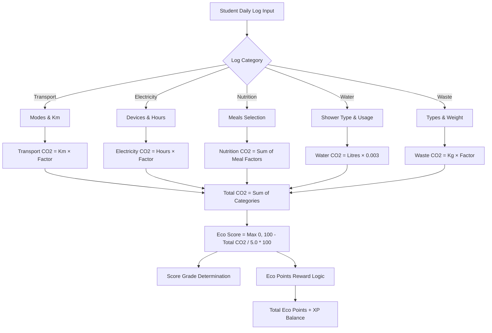

# Carbon Tracker Calculation Engine & Architecture

This document outlines the detailed metrics, coefficients, algorithms, and logical flows driving the campus **Carbon Tracker**.

---

## 1. Calculation Logic Flow

---

## 2. Emission Factors & Coefficients

All calculations are based on standard Intergovernmental Panel on Climate Change (IPCC) standards, adjusted for the Indian regional power grid factor.

### A. Transport Factors (kg CO₂ / km)
*   **Car (Solo)**: `0.210`
*   **Motorbike**: `0.120`
*   **City Bus**: `0.089`
*   **Auto Rickshaw (CNG)**: `0.076`
*   **Car (Shared)**: `0.053`
*   **College Bus**: `0.048`
*   **Electric Scooter**: `0.025`
*   **Bicycle / Walking**: `0.000`

### B. Electricity Factors (kg CO₂ / Hour)
Uses the Indian Grid emission factor of **0.82 kg CO₂ / kWh** times device power ratings:
*   **AC (1.5 Ton)**: `1.476` (Power: 1.80 kW)
*   **AC (1.0 Ton)**: `1.230` (Power: 1.50 kW)
*   **Washing Machine**: `0.410` (Power: 0.50 kW)
*   **Desktop PC**: `0.164` (Power: 0.20 kW)
*   **Ceiling Fan**: `0.057` (Power: 0.07 kW)
*   **Laptop**: `0.041` (Power: 0.05 kW)
*   **Mobile Charging**: `0.008` (Power: 0.01 kW)
*   **LED Bulb**: `0.007` (Power: 0.009 kW)

### C. Food Factors (kg CO₂ / Meal)
*   **Red Meat (Beef/Pork)**: `3.50`
*   **Non-Veg (Chicken/Mutton)**: `1.50`
*   **Egg-based**: `0.80`
*   **Vegetarian**: `0.50`
*   **Vegan**: `0.30`
*   **Skipped Meal**: `0.00`

### D. Water Factors (0.003 kg CO₂ / Litre)
Total Litres = Shower Type + General Usage level:
*   **Shower Types**:
    *   Long Shower (15+ mins): `150L`
    *   Medium Shower (10 mins): `100L`
    *   Short Shower (5 mins): `50L`
    *   Bucket Bath: `15L`
*   **General Usage Levels**:
    *   High: `150L`
    *   Medium: `100L`
    *   Low: `50L`

### E. Waste Factors (kg CO₂ / kg Waste)
*   **Plastic**: `0.60`
*   **General/Mixed**: `0.50`
*   **Paper**: `0.20`
*   **Recycled**: `0.10`
*   **Organic/Compost**: `0.05`

---

## 3. Score & Reward Algorithms

### A. Eco Score
Evaluated against a campus budget of **5.0 kg CO₂** per student per day:
$$\text{Eco Score} = \max\left(0, 100 - \left(\frac{\text{Total CO}_2}{5.0} \times 100\right)\right)$$

#### Score Grades:
*   **$\ge$ 90**: Excellent (Grade: *Eco Champion*)
*   **$\ge$ 70**: Good (Grade: *Eco Friendly*)
*   **$\ge$ 50**: Average (Grade: *Room to Improve*)
*   **$\ge$ 25**: Poor (Grade: *Needs Attention*)
*   **$< 25$**: Critical (Grade: *High Impact Day*)

### B. Eco Points (XP)
Calculated dynamically to reward sustainable actions:
*   **Base Points**: `10 XP` for logging daily.
*   **Performance Bonuses**:
    *   Eco Score = 100: `+60 XP`
    *   Eco Score $\ge$ 90: `+40 XP`
    *   Eco Score $\ge$ 70: `+20 XP`
*   **Transport Mode Bonuses**:
    *   Active Transit (Bicycle/Walking): `+15 XP`
    *   College Bus: `+12 XP`
*   **Meal Diet Bonuses**:
    *   All Vegan Day: `+15 XP`
    *   All Vegetarian Day: `+10 XP`
*   **Logging Streak Bonuses**:
    *   3-Day Streak: `+30 XP`
    *   7-Day Streak: `+75 XP`
    *   30-Day Streak: `+200 XP`
*   **First Ever Log Bonus**: `+50 XP`
